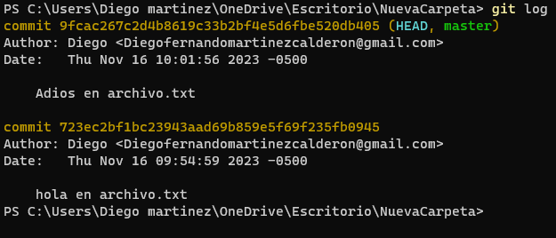
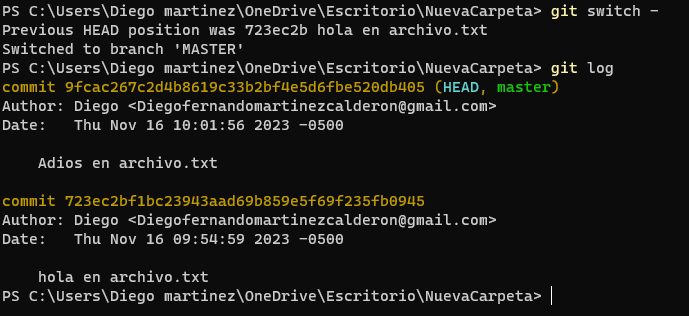

# GIT

Es un sistema de control de versiones.

Instalacion de GIT:

[https://git-scm.com/book/es/v2/Inicio---Sobre-el-Control-de-Versiones-Instalaci%C3%B3n-de-Git ]()

---

## comandos básicos de la terminal de comandos:

`Ctrl+L`  limpia la terminal

`pwd`: Imprimir la ruta del directorio actual

`rmdir`: Eliminar un directorio vacío

`ls ` Muestra los archivos que contenga la carpeta en la que estamos situados

`cd ` direccionarnos solo a carpetas

`cd .. ` direcciona a una carpeta exterior

`cat archivo.txt ` abrir un archivo en la terminal

`New-Item -Path /home/usuario/archivo.txt  ` creará un archivo con el nombre `archivo.txt` en el directorio `/home/usuario`:

`New-Item archivo.txt ` crea un archivo.txt en la pasición actual

`New-Item -Path archivo.txt -Type File -Value "hola"` crea un archivo.txt con un hola dentro

`New-Item  archivo2.txt -Value "hola2" `   forma abreviada

`echo "hola" >> archivo.txt ` y si ya estaba previamente creado el archivo .txt vacio y quiere agg texto

`Set-Content -Path archivo.txt -Value "hola adios"` para editar el contenido de este archivo.txt

`rm`: Eliminar un archivo

`mv`: Mover un archivo o directorio

`cp`: Copiar un archivo o directorio

` mkdir carpeta`  creará una carpeta con el nombre `carpeta` en el directorio actual:

## Comandos de Git

`git clone <url>`  => Clona un repositorio remoto

`git push origin ` => Envía los cambios al repositorio remoto,en la rama que se especifica. Esto solo envía los cambios que han sido confirmados.

---

Establecer el nombre de usuario de Git en `Juan Pérez`, escribirías el siguiente comando:

```
git config user.name "Juan Pérez"
```

**Para establecer la dirección de correo electrónico de Git:**

```
git config user.email "juan.perez@example.com"
```

---

Para inicializar un proyecto con git, se debe abrir la terminal en la carpeta que queremos hacer el control de versiones de archivos seguido utilizamos el comando:

`git init`

El comando git init se utiliza para inicializar un nuevo repositorio de Git. Esto significa crear una estructura de directorios y archivos que Git necesita para rastrear los cambios en los archivos.

Si deseas inicializar un repositorio con un nombre diferente, puedes pasar el nombre del repositorio como argumento al comando git init:

`git init my-repository`

---

`git status`

El comando git status se utiliza para mostrar el estado del directorio de trabajo y del área **de ensayo. Permite ver los cambios que se han preparado, los que no y los archivos en los que Git no va a realizar el seguimiento.**

**El comando git** status muestra una serie de indicadores para cada archivo en el directorio de trabajo:

* **A:** El archivo ha sido modificado, pero no ha sido agregado al área de ensayo.
* **M:** El archivo ha sido modificado y agregado al área de ensayo.
* **?:** El archivo no está siendo rastreado por Git.
* **U:** El archivo ha sido modificado desde la última confirmación, pero no ha sido modificado desde la última vez que se agregó al área de ensayo.
* **D:** El archivo ha sido eliminado del directorio de trabajo, pero aún está siendo rastreado por Git.

El comando git status también muestra una serie de mensajes de estado:

* **Untracked files:** Lista los archivos que no están siendo rastreados por Git.
* **Changes to be committed:** Lista los archivos que han sido modificados y agregados al área de ensayo.
* **Changes not staged for commit:** Lista los archivos que han sido modificados, pero no han sido agregados al área de ensayo.

---

`git add <nombre del archivocon su .tipoDeArchivo>` ejemplo `git add app.js`

El comando git add se utiliza para mover los cambios del directorio de trabajo al área de ensayo. Esto significa que los cambios se prepararán para ser confirmados en el historial de Git.

```
# Agregar todos los archivos modificados
git add .

# Agregar un archivo específico
git add archivo.txt

# Agregar un directorio específico
git add directorio
```

* **`git reset <nombre-archivo>`:** El comando `git reset` para sacar un archivo del `git add .`
* `git diff `para mostrar los cambios del archivo entre dos commits,
  ejemplo : `git diff 2154542187455df458df54d5 a5s4d5sf8sdf5sdf45sdfd `
* **`git commit`:** El comando `git commit` crea una instantánea de los cambios en el área de preparación. El mensaje del commit describe los cambios realizados. Para crear un commit con un mensaje, puedes utilizar el siguiente comando:

```
git commit -m "Mensaje del commit"
```

* **`git log`:** El comando `git log` muestra el historial de cambios del repositorio. El historial incluye la fecha y hora del cambio, el autor del cambio, el mensaje del cambio y los archivos afectados.
* **`git checkout`:** El comando `git checkout` cambia a una rama específica. Las ramas son una forma de organizar los cambios en el repositorio.
* **`git merge`:** El comando `git merge` fusiona dos ramas. Las fusiones se utilizan para combinar los cambios de dos ramas en una sola rama.

  `git merge rama_origen -m "Mensaje de commit"`
* **`git push`:** El comando `git push` publica los cambios en un repositorio remoto. Los repositorios remotos son repositorios de Git que se almacenan en un servidor.
* `git checkout -- .` nos redirige la informacion al último commit que hicimos

---

-Para crear una rama en Git, utiliza el comando `git branch`. La sintaxis básica es la siguiente:

```
git branch nombre-de-la-rama
```

---

-Por ejemplo, para crear una rama llamada `nueva-rama` a partir de la confirmación con el hash `1234567890`, escribirías el siguiente comando:

```
git branch nueva-rama 1234567890
```

---

-Eliminar una rama en Git, utiliza el comando `git branch -d`. La sintaxis básica es la siguiente:

```
git branch -d nombre-de-la-rama
```

Este comando eliminará la rama `nombre-de-la-rama` si está fusionada con la rama actual. Si la rama no está fusionada, Git te avisará y tendrás que fusionarla manualmente antes de poder eliminarla.

---

-También puedes utilizar el comando `git branch -D` para eliminar una rama sin importar si está fusionada o no. La sintaxis es la siguiente:

```
git branch -D nombre-de-la-rama
```

---

-Cambiar de rama  `git checkout`. La sintaxis básica es la siguiente:

```
git checkout nombre-de-la-rama
```

---

-para fusionar una rama con la rama principal, debes estar en la rama principal git merge nombre de la rama

`git merge nueva-rama`

---

## Como eliminar un commit:

git log = para enlistar los commits,

git reset --hard 2506cd65ebb0e85387350ae392dbef626e06964c  = elimina los commits que se hicieron DESPUÉS de ese solo localmente(en mi pc)(tambien puede cambiar el hard por soft, mixed)

git push origin -f = envia los cambios al repositorio remoto,

si es a una rama especifica rama  (prueba):  git push origin prueba -f

---

## Viajar entre commits:

para viajar entre commits

`git log` para ver todos los commits con su respectivo **hash ** o número amarillo



podemos ver que hay dos commits el más reciente siempre es el de arriba, vamos a viajar al antiguo

`git checkout 723ec2bf1bc23943aad69b859e5f69f235fb0945` viajamos al antiguo 

El mensaje indica que ha cambiado a un commit específico con el mensaje "hola en archivo.txt". Ahora está en un estado de HEAD desconectado, lo que significa que no está actualmente en una rama. Puede realizar cambios en sus archivos y confirmarlos, pero estos cambios no estarán asociados con ninguna rama. Puede crear una nueva rama para conservar los commits que realice o puede deshacer el cambio al estado de HEAD desconectado.

`git switch -` para salir del estado de HEAD desconectado y volver al último commit en la rama que estaba 


